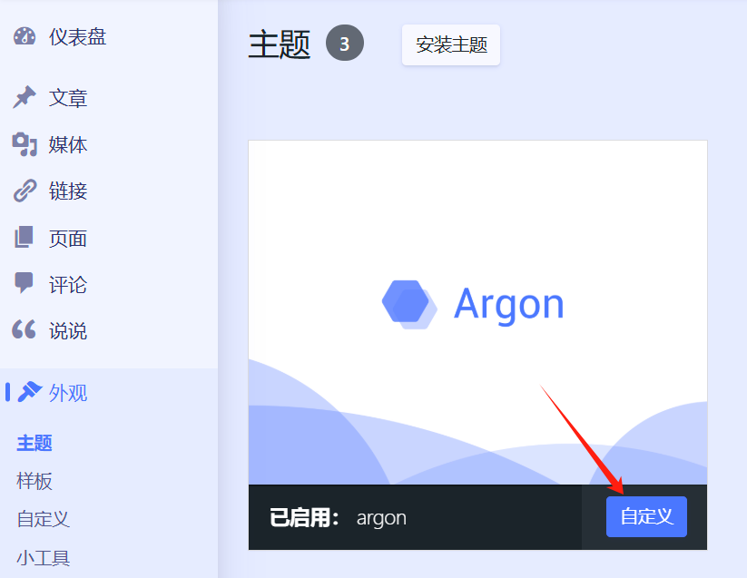
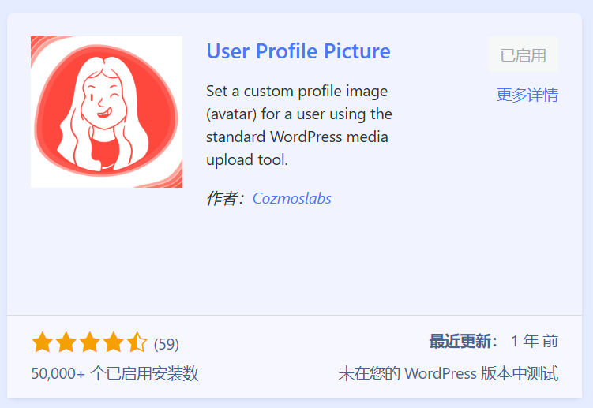
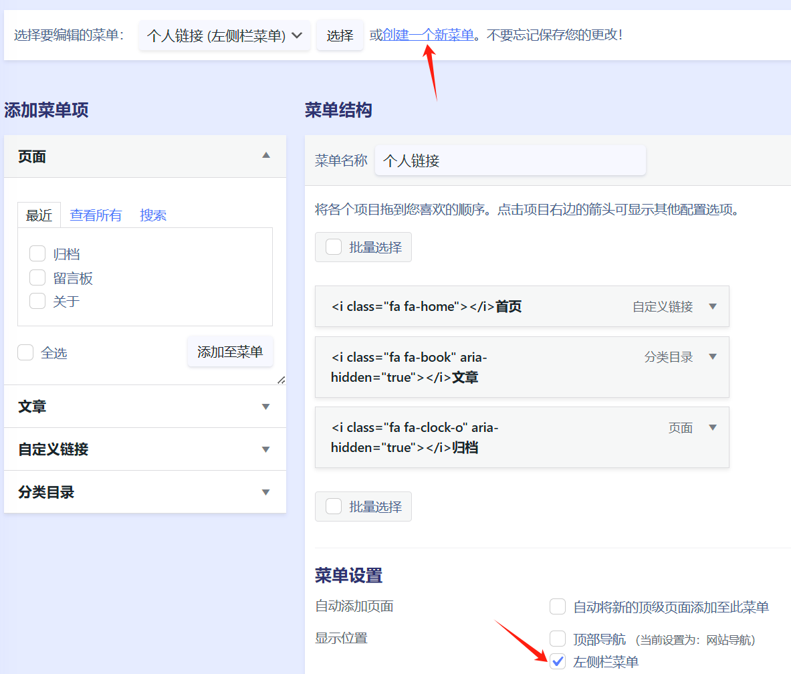

这是docker安装的1panel，然后安装wordpress，其主题路径  
/Configs/1Panel/1panel/apps/wordpress/wordpress/data/wp-content/themes

1panel开魔法安装，wordpress，mysql，openresty,**不要打开wordpress**  
进入1panel左侧的网站，创建一个应用wordpress，输入访问时用的主域名

访问设置的域名，在网页按指引安装好wordpress  
安装完后在1panel把主题argon文件夹放到这个目录下  
1panel/apps/wordpress/wordpress/data/wp-content/themes

## 导入保存好的主题选项配置

登录到wordpress仪表盘，在外观里启用Argon  
在Argon主题选项，点右下角的到底部然后点导入设置，复制Argon主题选项文件里的内容到弹出的框里，确定保存  
**Argon主题选项中全局底下有个CDN，默认选的是Jsdelivr (fastly)，自带的貌似都是国外的，改成不使用后公网访问就不经过CDN直接秒开了**  
**页脚，主题包里面有嘉然看板娘的代码，不用重复添加**

## 额外css

在外观，主题点argon的自定义，点进额外css填入，发布  
字体路径，不对要修改自己对应的  
@font-face{  
font-family:echo;  
src:url(**/wp-content/themes/argon/fonts/13.woff2**) format('woff2')  
}



## 给后台设置一个自己的头像

点击插件 点击添加新插件 搜索User Profile Picture 添加后启用 然后点击用户 点击个人资料 点击Profile Image 上传图片更改即可 同时修改管理配色方案为argon 名字 昵称 公开显示为 邮箱 点击更新个人资料



## 给网站上传白天和黑夜的背景

点击媒体 点击添加文件 上传即可 上传好后点击图片可查看图片的位置 复制图片url位置 点击argon主题选项 点击右边大纲--页面背景 粘贴url地址到页面背景/页面背景(夜间模式时)输入框

## 设置菜单栏

先点进页面,添加页面  
标题填归档，模板选归档时间轴  
标题填留言板，模板选留言板，讨论开放  
还有其它自行添加

点进文章，分类文章  
把右侧已有的分类编辑名称填，文章。别名填，learn  
新建一个也可以

设置顶部菜单栏  
点进外观，菜单  
菜单名称填，网站导航  
左侧页面选择自定义链接，网址填自己的网站域名。链接文字填，首页。添加至菜单  
然后把文章，留言板，关于等添加至菜单  
菜单设置勾选顶部导航

![[image-4.png]]

设置左侧栏菜单  
在当前页面点击上方创建一个新菜单栏  
菜单名填，个人链接  
左侧页面选择自定义链接，网址填自己的网站域名。链接文字填，首页。添加至菜单  
然后把文章，归档等添加至菜单  
菜单设置勾选左侧栏菜单  
菜单图标，自行添加到导航标签



```
<i class="fa fa-home"></i>首页
<i class="fa fa-book" aria-hidden="true"></i>文章
<i class="fa fa-comment-o" aria-hidden="true"></i>碎碎念
<i class="fa fa-question-circle" aria-hidden="true"></i>关于
<i class="fa fa-comments" aria-hidden="true"></i>留言板
<i class="fa fa-youtube-play" aria-hidden="true"></i>bilibili主页
<i class="fa fa-clock-o" aria-hidden="true"></i>归档
```

## 年度倒计时显示

点击外观 在左侧栏小工具里面添加工具--简码

```
<div class="progress-wrapper" style="padding: 0">
<div class="progress-info">
<div class="progress-label">
<span id="yearprogress_yearname"></span>
</div>
<div id="yearprogress_text_container" class="progress-percentage">
<span id="yearprogress_progresstext"></span>
<span id="yearprogress_progresstext_full"></span>
</div>
</div>
<div class="progress">
<div id="yearprogress_progressbar" class="progress-bar bg-primary"></div>
</div>
</div>
<script no-pjax="">
function yearprogress_refresh() {
let year = new Date().getFullYear();
$("#yearprogress_yearname").text(year);
let from = new Date(year, 0, 1, 0, 0, 0);
let to = new Date(year, 11, 31, 23, 59, 59);
let now = new Date();
let progress = (((now - from) / (to - from + 1)) * 100).toFixed(7);
let progressshort = (((now - from) / (to - from + 1)) * 100).toFixed(2);
$("#yearprogress_progresstext").text(progressshort + "%");
$("#yearprogress_progresstext_full").text(progress + "%");
$("#yearprogress_progressbar").css("width", progress + "%");
}
yearprogress_refresh();
if (typeof yearProgressIntervalHasSet == "undefined") {
var yearProgressIntervalHasSet = true;
setInterval(function () {
yearprogress_refresh();
}, 500);
}
</script>
<style>
#yearprogress_text_container {
width: 100%;
height: 22px;
overflow: hidden;
user-select: none;
}
#yearprogress_text_container > span {
transition: all 0.3s ease;
display: block;
}
#yearprogress_text_container:hover > span {
transform: translateY(-45px);
}
</style>
```

## 添加嘉然看板娘

主题选项，页脚，添加代码  
主题包里面有嘉然看板娘的代码，不用重复添加

```
</script>
<!--live2d--> 
<script src="/wp-content/themes/argon/argon/live2d/TweenLite.js"></script> 
<script src="/wp-content/themes/argon/argon/live2d/live2dcubismcore.min.js"></script>
<script src="/wp-content/themes/argon/argon/live2d/pixi.min.js"></script> 
<script src="/wp-content/themes/argon/argon/live2d/cubism4.min.js"></script> 
<link href="/wp-content/themes/argon/argon/live2d/pio.css" rel="stylesheet" type="text/css"/> 
<script src="/wp-content/themes/argon/argon/live2d/pio.js"></script> 
<script src="/wp-content/themes/argon/argon/live2d/pio_sdk4.js"></script> 
<script src="/wp-content/themes/argon/argon/live2d/load.js"></script>
```

  
由于看板娘是本地引用，主题包里live2d文件夹内的pio.css文件里  
url里的路径对应着隐藏看板娘后左下角的小图片，不生效时可以看一下文件夹里有没有这张图片，或者路径有没有错


```
.pio-container .pio-show {
background: url(/wp-content/themes/argon/live2d/avatar.png) center/contain;
}
```